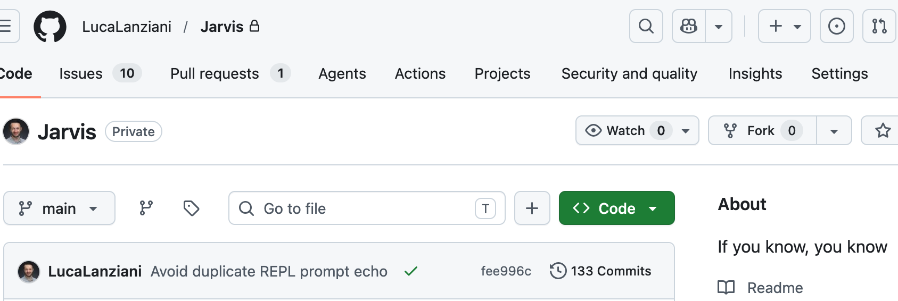

For the past few months I've been hacking on **Jarvis** in the evenings: a small Go agent that gives an LLM a handful of local tools (read files, run shell, spawn sub-agents, that kind of thing). I'm not trying to ship the next OpenClaw clone. I just wanted to see how the pieces fit together when you build them yourself.

<!--more-->



## Why bother

I use agentic tools every day, but most of what happens is behind a UI. The model picks a tool, something runs, I get an answer. Fine, but I kept wondering about the boring parts: the loop that caps iterations, what happens when the provider streams tokens and tool calls in the same response, why Copilot and Anthropic feel different to wire up, and whether "don't run dangerous commands" belongs in the system prompt or in actual code.

Jarvis is where I answer those questions by breaking things and fixing them.

Every feature I add comes from something I didn't understand until I coded it. How do you bound a multi-turn tool loop? What if the model fires two tool calls at once? Can you sandbox file reads with Go's `os.Root` without making edits painful? When should `shell` pause for a human yes/no? Sub-agents were another rabbit hole: useful for delegation, scary if they can spawn forever.

On top of Jarvis I also maintain **[langchain-go](https://github.com/LucaLanziani/langchain-go)**, a thin layer for tools and providers. Working on both at once helps: if the framework API is awkward, I feel it immediately in Jarvis.

## Rough shape

You talk to it from a REPL or from Telegram. Under the hood it loops: call the model, run whatever tools come back, feed results in, repeat until done or until it hits a limit.

```
You (REPL or Telegram)
  → Jarvis agent loop (tool dispatch, limits, approvals)
  → Provider (OpenAI | Anthropic | GitHub Copilot)
  → Tools (files, shell, sub-agents, skills, …)
```

The repo is private. This is for me to learn, not for anyone to clone and run.

## Where it's at

It's gone past the "hello world with tools" stage. There's a v0.0.1 tag, CI, and enough docs that future-me won't hate present-me.

| Area | Status |
|------|--------|
| **Runtimes** | Interactive REPL, Telegram bot, non-interactive pipe / `-prompt` mode |
| **Providers** | OpenAI, Anthropic, GitHub Copilot |
| **Core tools** | `read_file`, `write_file`, `edit_file`, `list_directory`, `shell` |
| **Agent model** | Supervisor + `run_agent` sub-agents (no recursion); sub-agents get `ask_user` instead |
| **Skills** | Agent Skills–compatible `SKILL.md` packages with `activate_skill` |
| **Extensibility** | External tools from `*.tool.json` at startup |
| **Safety** | File tools sandboxed to `WorkDir` (Go 1.25 `os.Root`); runtime modes (`default`, `read-only`, `approval-required`); approval gate for dangerous tools |
| **Sessions** | Save/load, managed REPL sessions, backslash commands (`\new-session`, `\set-mode`, etc.) |
| **Config** | Layered JSON: defaults → `~/.jarvis` / `.jarvis` → CLI flags |
| **UX** | Bubble Tea prompt with arrow-key editing; optional **tmux** layout (interactive + logs + sub-agent panes) |
| **Observability** | Structured logging + OpenTelemetry tracing across supervisor and sub-agent runs |

Lately I've been adding skills, reloading config without restarting the REPL, and an "AFK" path that forwards `ask_user` prompts to Telegram when I'm not at the laptop. Traces across supervisor and sub-agent runs saved me more than once when a tool call failed in a weird way.

I use it for real chores now: skim a repo, run a bounded shell command, hand off a smaller task to a sub-agent, or poke it from my phone. Nothing production-grade, but it works for what I built it for.

## Still on the list

There's a long `features/` folder with ideas I haven't touched yet: git status/diff tools, MCP bridge, web fetch, eval runner, notebook support, tighter sandbox presets. A bunch of stuff in there already shipped; the rest is "nice to learn, not urgent."

Same for `fixes/`: race conditions around approvals, history growing without a cap, sub-agents hanging without a timeout. Annoying bugs, but the kind you only find when you actually run agents for hours.

## Things I settled on

File access goes through a sandbox rooted at `WorkDir`. Shell does not pretend to be safe; if I want guardrails, that's approvals and deny lists, maybe containers later. When I dogfood on the Jarvis repo itself, the default config blocks `shell` and `write_file` so I don't accidentally let the agent trash its own source.

Sub-agents copy the supervisor's workdir and tool policy but can't call `run_agent` again. That was a deliberate choice after watching one delegation turn into three.

REPL and Telegram share the same agent code. Telegram forced me to handle things the terminal didn't care about: one conversation at a time, remote approvals, timeouts, cancelling a stuck turn.

I log every tool execution and export traces. Guessing why the model called `rm -rf` is worse than reading a span.

## What's next

I'll keep treating it as a lab. I want to compare providers more systematically (streaming quirks, tool schema errors), plug in more tools without turning the binary into a kitchen sink, and eventually run repeatable evals so I notice regressions.

If you're building your own agent runtime for the same reasons, I'd be curious what surprised you. My code stays private, but the problems (tool loops, safety, sessions, sub-agents) are the same ones everyone is hitting right now.
