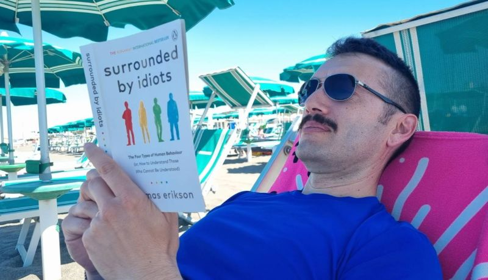

Week 1 of my well-deserved break! 🏖️📚

<!--more-->

Nothing beats combining some quality beach time with a good read.
Currently diving into "Surrounded by Idiots" by Thomas Erikson - fascinating insights into understanding different personality types and communication styles.
It's amazing how stepping away from the daily grind gives you space to reflect and learn. Sometimes the best professional development happens when you're not actually "working" 🤔.
The irony isn't lost on me that I'm reading about communication patterns while completely disconnected from Slack notifications 😄.
One week down, one more week of recharging to go!
What's the best book you've read during your time off? Drop your recommendations below! 👇

