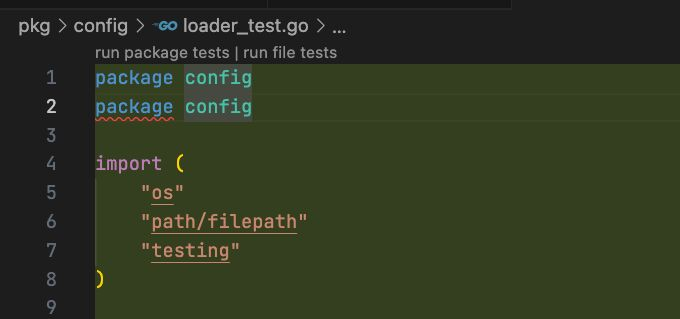

Has anyone else encountered this issue with Claude 4.5 Sonnet?

<!--more-->

While running my BMAD experiment I've noticed it frequently starts new files with a duplicated package definition. Curious if this is a known bug.
I'll be sharing a full report on my experience soon, just had to take a quick break for the fantastic
last week!

