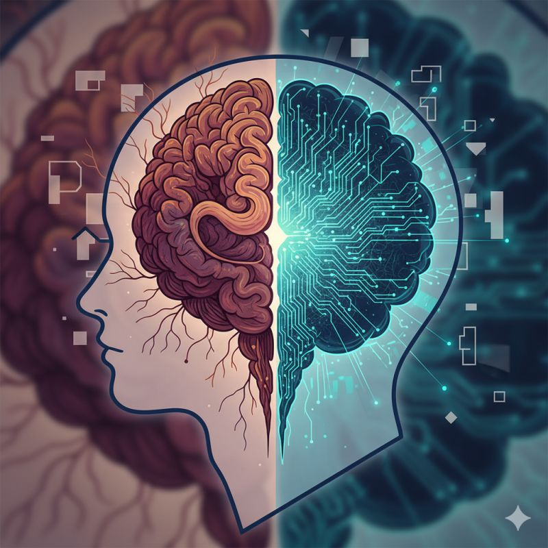

"I was highly skeptical, but now I'm a believer."

<!--more-->

That's a phrase I find myself repeating constantly in recent conversations about LLMs and AI and it turns out, I'm far from alone! I've heard/read variations of this statement multiple times in the past few weeks.
My own perspective has evolved over the past few months due to three primary factors:
1. Model Evolution and Agentic Capabilities: Advances in AI models, particularly the development of "Agentic mode," have enabled previously unfeasible applications.
2. Identification of Practical Applications: I identified specific use cases where LLMs demonstrated undeniable value, prompting further investigation.
3. Enhanced Proficiency and Confidence: Initial successes fostered increased confidence, leading to broader experimentation and improved skill in leveraging AI.
For those yet to fully engage with AI, consider the opportunities for discovering your own impactful applications. The journey from skeptic to believer is a powerful one.
In the spirit of transparency, I even used an AI to help refine the phrasing of this very post—a small but practical example of the value I've come to appreciate.

