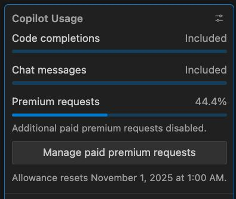

I was running out of credits 😬... until Wednesday.

<!--more-->

So far this month, I've reached 44% of my premium request quota using Claude Sonnet 4.5 through my GitHub Copilot membership—and that's even with taking a week off to attend GrafanaCon in London.
This week, Anthropic unveiled Claude Haiku 4.5, a new model that promises similar performance to Sonnet but at a fraction of the cost. For my workflow, it will cut my premium request usage by two-thirds.
This development effectively triples my remaining capacity for the month, unlocking significant potential for more ambitious projects.
It's exciting to see the trend: powerful AI models are becoming increasingly accessible and affordable.
I've put the link to the announcement in the first comment (you know why, algorithm).
In the spirit of transparency, I used an AI to help refine the phrasing of this very post—a small but practical example of the value I've come to appreciate.

