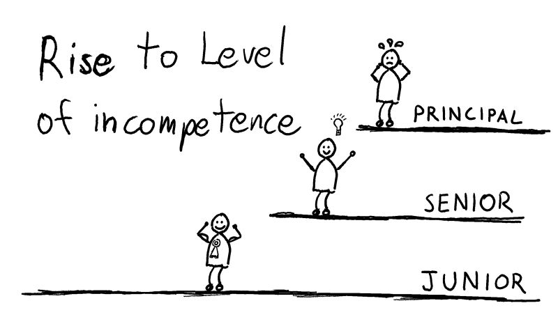

The Peter Principle – ever heard of it?

<!--more-->

It's the idea that people in a hierarchy often get promoted to a point where they're no longer effective.
It makes you reflect on growth, continuous learning, and how we can support our teams in new roles.
How do you navigate this in your own career or within your organization? I'd like to hear your thoughts.

