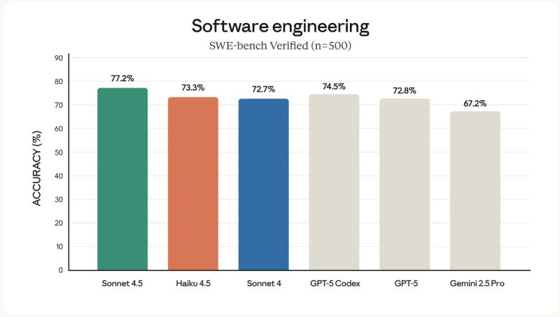

Claude Haiku 4.5 has failed us. 😮‍💨

<!--more-->

We hoped to switch to Claude Haiku 4.5 to optimize for cost and speed, but the trade-off in performance was too high. Both
Piotr Zimoch
and I have seen inconsistent behavior from this model and moved back to Sonnet 4.5.
We considered adapting our interaction methods for the different model, but the root cause appeared to be model inconsistency itself.
It's a clear reminder that benchmarks don't tell the whole story. Real-world testing and vigilance are critical when switching models.
Have you encountered similar issues with model performance?
In the spirit of transparency, I used an AI to help refine the phrasing of this very post—a small but practical example of the value I've come to appreciate.
https://lnkd.in/d4mtKJ55

