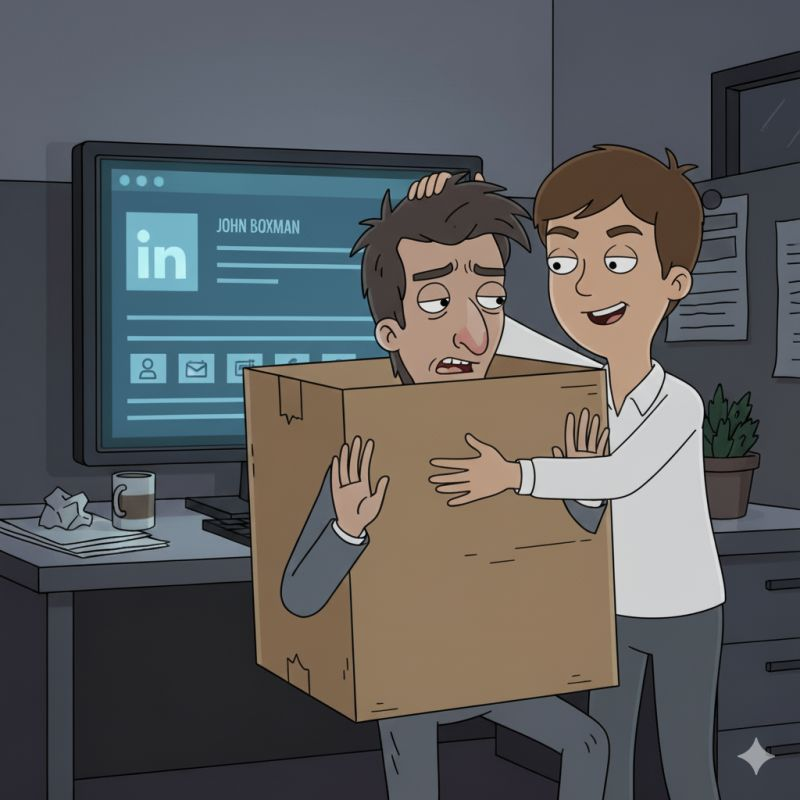

There's something harder to quit than Vim.*

<!--more-->

​It's the box people put you in.
​We've all heard the saying: "You never get a second chance to make a first impression."
​That's true in every situation—in your private life, at work, or when meeting strangers.
​Think about it:
​A new colleague joins your company.
They see you doing Job A.
They'll probably assume that's your entire expertise.
​Just like that, you've been boxed in.
​The same is true right here.
​When someone lands on your LinkedIn profile, what is their immediate impression?
​What box do they put you in?
​And is it the right one?
​* For my non-tech friends, Vim is a text editor notoriously difficult to exit.
In the spirit of transparency, I used an AI to help refine the phrasing of this very post—a small but practical example of the value I've come to appreciate.

