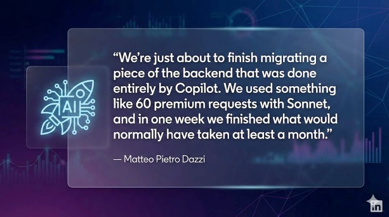

if (1 week == 4 weeks) { 🤯 }

<!--more-->

AI is a huge accelerator for some of the work we do.
It’s not magic, and you have to learn to use it; but once you do, it clearly becomes a multiplier of your team's skills.
If you are a company, give your team license to test and experiment with it. Find the people who are already championing it and bring their experience in front of the rest of the organization.
Thanks
Matteo Pietro Dazzi
for sharing this with us.

