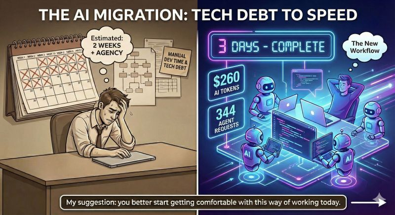

if (3 days == 2 weeks) {🤯}

<!--more-->

Yesterday I told you how Matteo completed a 4 weeks refactoring in 1 week. Today, I can share another story with you.
​Lee Robinson just published a fascinating breakdown of how he migrated the entire
cursor.com
website from a headless CMS back to raw code.
​The project was estimated to take weeks, perhaps even requiring an external agency.
Instead, Lee finished it in 3 days with $260 in AI tokens.
​344 agent requests, the right tool and the right workflow replaced weeks of manual dev time.
​Lee’s conclusion is a wake-up call for engineering teams: "Tech debt that was buried deep in the backlog" can now be solved by spending tokens rather than burning developer burnout hours.
My suggestion: you better start getting comfortable with this way of working today. 📢
​Read the full retrospective here:
https://leerob.com/agents
​

