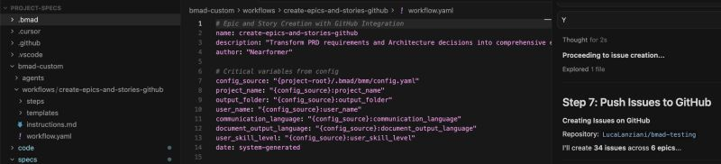
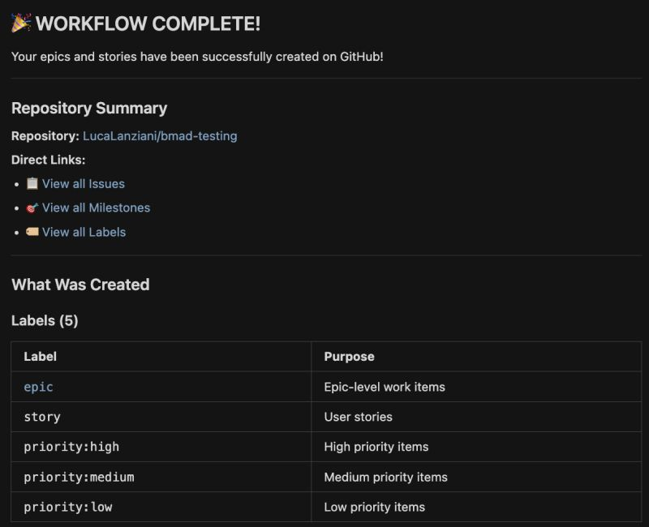
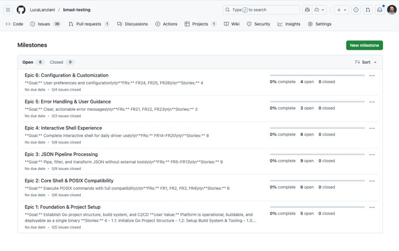
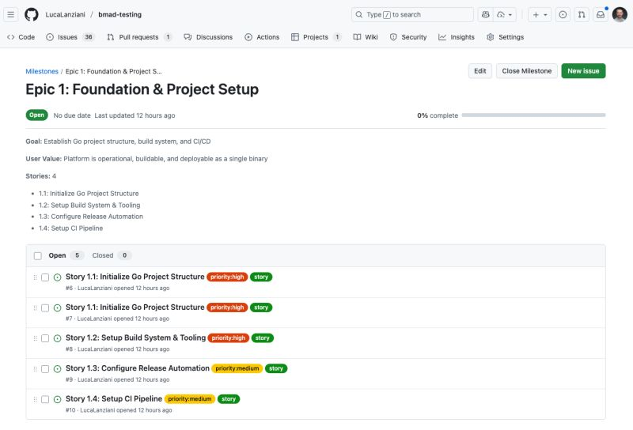

You’ve likely heard about Spec-Driven Development by now.

<!--more-->

We’ve moved from "AI can write code" to "prompt engineering," and from "vibe coding is the future" to "it's all about specs."
As I’ve shared before, I've bought into the BMAD method, and I find it offers real benefits when working on decently sized projects.
Sure, v6 is a bit too chatty for my liking, but the advantages are clear; especially if you fully embrace workflows, and even more so if you create your own.
That's why, after spending a few days trying to devise the perfect way to share Epics and Stories between team members using BMAD, I decided to go the dedicated workflow route.
Attached are some pictures of the workflow definition BMAD uses to create Epics and Stories, mapping them to Milestones, Issues, and Labels on GitHub.
It’s been quite a fun experience. The next step is for the developer to have a workflow to consume these from GitHub, which will unlock the true collaboration path.
In the last picture, you can see how this approach allowed me to assign one of the issues to a BMAD agent directly from the GitHub interface.
I have to say, I'm having a lot of fun with this tool, so much so that some friends and I started
https://ainativeteams.com/
, where we write about these topics.
I might write a longer post about this approach there in the near future and I'm expecting a lot to happen over the Christmas break! 🚀

