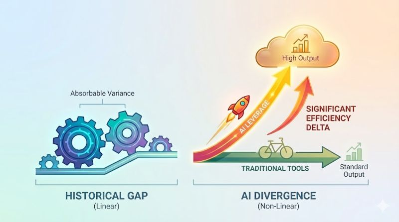

Historically, the productivity gap between a developer who mastered their toolset and one who did not was observable, but rarely critical. The variance in output was narrow enough to be absorbed by the team.

<!--more-->

However, the integration of AI tools introduces a much wider performance divergence. The efficiency delta between developers who effectively utilize AI assistance and those who do not is becoming significant enough that it can no longer be treated as a marginal difference.

