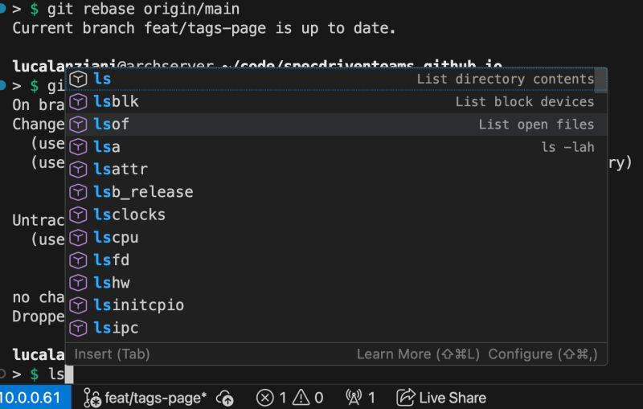
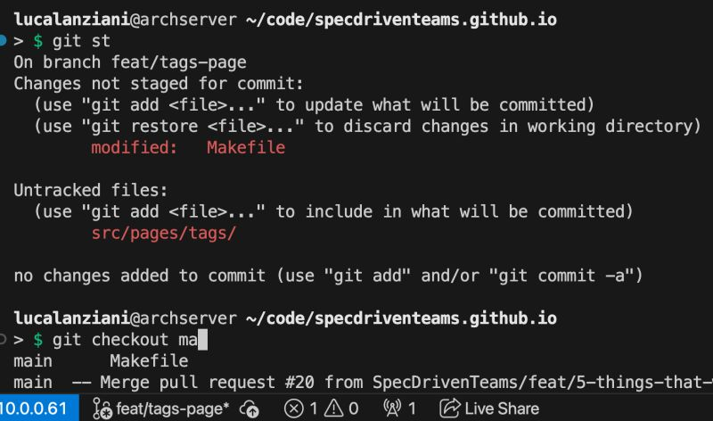
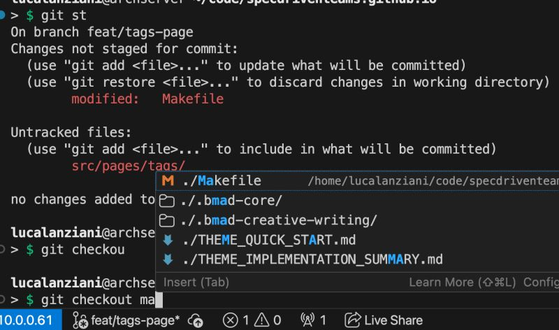

Is anyone else frustrated by the Terminal IntelliSense feature in VS Code?

<!--more-->

It disrupts my muscle memory and offers nonsensical suggestions...
previously: typing 'git checkout ma<tab>' resulted in 'git checkout main' 🎉
but now: 'git checkout ma<tab>' ends up as 'git checkout ./Makefile' 🤦‍♂️

