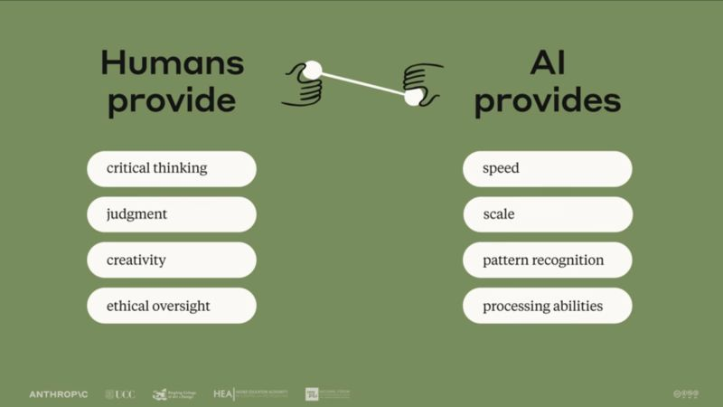

So you've decided to try AI-assisted development. Let me save you some frustration.

<!--more-->

After months working with SDD and AI agents, I've watched developer hit the same five predictable mistakes. Here's what you're about to learn the hard way:
1. You'll expect determinism
AI is non-deterministic by design. The same prompt yields different results. Time of day matters. Model updates shift behavior. This isn't a bug, you have to work with it, not against it.
2. You'll go full-on with agents
You'll spend three hours forcing an agent to solve a twenty-minute problem. Sometimes writing the code yourself is faster. Know when to take over.
3. You'll tinker with models constantly
Every week a new "best" model drops. You'll switch mid-project chasing marginal gains. Instead: pick the strongest model you can afford and eliminate that variable.
4. You'll fall into the LGTM trap
Code that runs isn't automatically good code. Agents produce working solutions with missing edge cases, over-engineering, and subtle production bugs. You're still responsible for what gets merged.
5. You'll try once when you should iterate
Some tasks benefit from iteration; test generation, documentation, feature scaffolding. Know which problems need refinement versus which need you to take over after two failures.
The pattern? AI should accelerate your workflow, not replace your judgment. You're still the senior developer in this pair programming session.
After a couple months, this becomes intuition. Until then, avoid these traps.
The image is from the AI Fluency: Framework & Foundations free course offered by Anthropic, link in the first comment.

