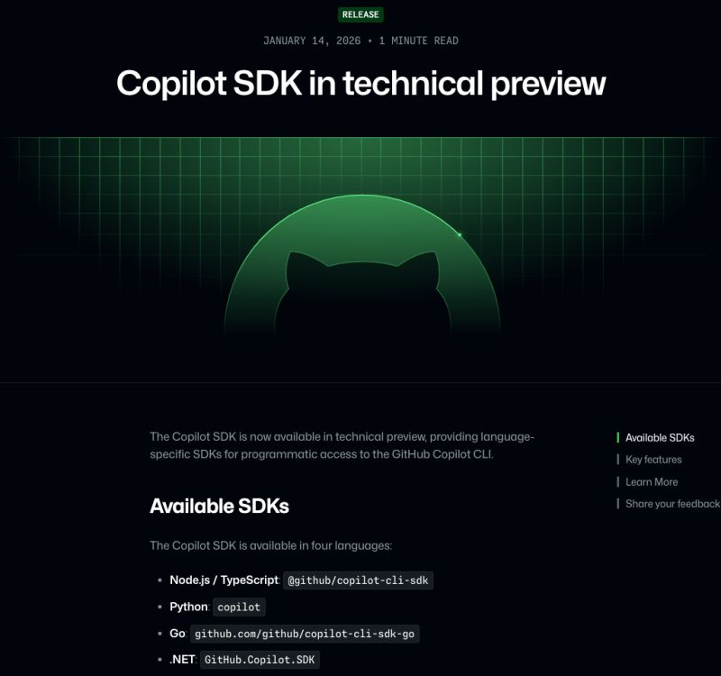

Talk about perfect timing! 🤯

<!--more-->

Last week, I dove headfirst into a new project: building an Agentic System using Google ADK and LangChain. To try and bring autonomous agents into a real-world workflow.
I wanted to try and use my existing GitHub Copilot subscription but the only options seemed to be a community workarounds (like the github-copilot-api-vscode project) to bridge the gap.
Then, yesterday happened. GitHub officially released the Copilot SDK.
Has anyone else started migrating their agents to the new SDK yet?

