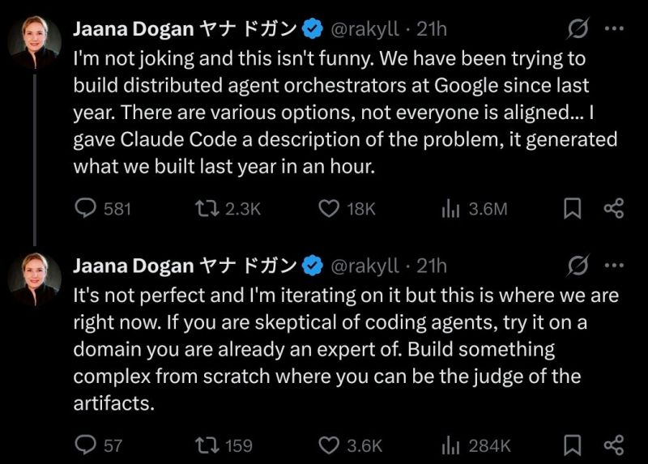

The irony; in her latest post Jaana clarified the situation even more, here is what she said (I'm copying her Twitter thread below):

<!--more-->

"To cut through the noise on this topic, it’s helpful to provide more more context:
- We have built several versions of this system last year.
- There are tradeoffs and there hasn't been a clear winner.
- When prompted with the best ideas that survived, coding agents are able to go very far and generate a good decent toy version in an hour or so.
- It's totally trivial today to take your knowledge and build it again, which wasn't possible in the past.
- Organization inertia can be real but it's also to hard to build infra that works for many use cases at a large company.
- It takes years to learn and ground ideas in products, then come up with patterns that will last for a long time.
- Once you have that insight and knowledge, building isn't that hard anymore.
- Because you can build from scratch, the final artifacts are free from baggage.
What I built this weekend isn't production grade and is a toy version, but a useful starting point. I am surprised with the quality of what's generated in the end because I didn't prompt in depth about design choices yet CC was able to give me some good recommendations."
The lesson here is again that there is still definitely a lot (A LOT) of hype, and the amount of hype in the past 2 years has burned out a lot of people.
Please try to ignore it; there is value in the latest models and there is value in you trying them and learning how to use them.
Play around with the tools if you can, form your opinion, good or bad, and bring back feedback on what worked and what didn't.
We need these feedback loops.
P.S. If you don't feel like it, it's also fine, the last years have been crazy.

