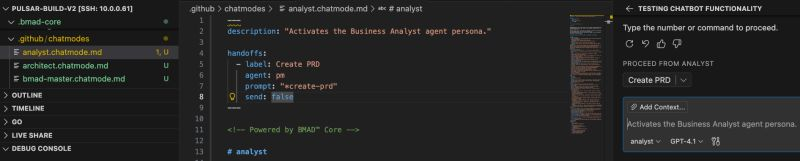

TIL: You can define handoffs in your custom Copilot Agents.

<!--more-->

This adds a button to the chat that allows you to switch between agents during specific flows. It is particularly useful for BMAD when following various workflows.
This will make the experience a lot smoother for your developers.

