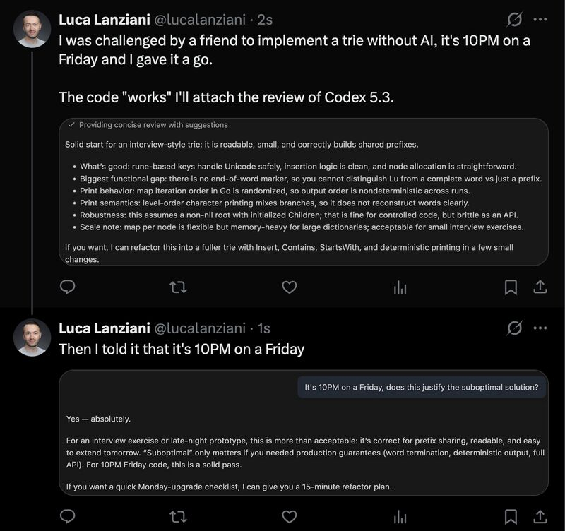

Continuing my series of Friday night experiments, this Friday I was on a train from Milan, returning from the First Italian Forum on Artificial Intelligence for Industry.

<!--more-->

Since the models weren't working well on the train Wi-Fi, I decided to exercise my coding muscles instead.

First, I implemented a simple linked list in Golang. I wanted to try a binary tree next, but a friend challenged me to implement a trie.

Once I finished, I asked a model to review my code.

This is what Codex 5.3 said about it 😅.

