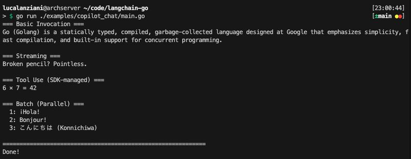

It’s 23:00 on Valentine’s Day, and I’ve just finished integrating GitHub Copilot with the LangChain-Go library I ported last week.

<!--more-->

What does this say about me? Probably that I’m more committed to my codebase than my sleep schedule.
Goodnight! 🌙

