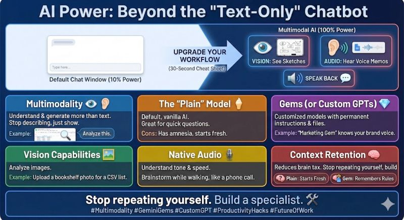

Stop treating your AI like a text-only chatbot.

<!--more-->

If you are only typing text into the "default" window, you are using about 10% of the tool's power.
Here is your 30-second cheat sheet on upgrading your workflow. 👇
Multimodality 👁️👂 The ability of an AI to understand and generate more than just text. It can "see" your whiteboard sketches, "hear" your voice memos, and "speak" back to you.
Why it matters: Stop describing your spreadsheet. Just screenshot it and say, "Analyze this."
The "Plain" Model 🍦 The default, vanilla version of the AI (e.g., opening a fresh chat).
Pros: Great for quick, one-off questions or brainstorming.
Cons: It has amnesia. You have to explain who you are and what you want every single time.
Gems (or Custom GPTs) 💎 Customized versions of the model that you "save" for specific tasks. You give them a permanent set of instructions and files so you don't have to repeat yourself.
Example: Instead of prompting the plain model every morning, you build a "Marketing Gem" that already knows your brand voice and product list. (This post was reviewed by the writing editor gem of gemini)
Vision Capabilities 🖼️ The AI’s ability to analyze images.
Use Case: Upload a photo of a messy bookshelf and ask for a CSV list of the titles. Upload a UI mockup and ask for the code.
Native Audio 🎙️ Newer models don't just transcribe text; they understand tone, emotion, and speed. You can brainstorm with them while walking the dog, just like a phone call.
Context Retention 🧠 The difference between a "Plain" model (starts fresh) and a "Gem" (remembers your rules). Using a Gem reduces the "context switching" tax on your brain.
Stop repeating yourself. Build a specialist. 🛠️
The image in the post was generated by nano banana.

