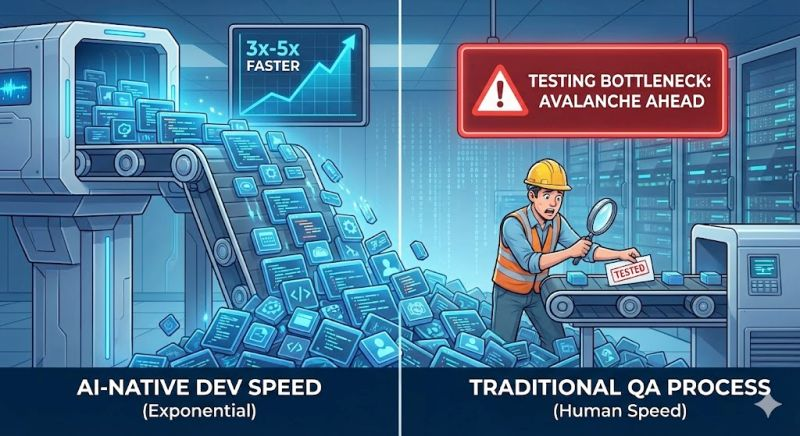

The biggest bottleneck in the AI-Native SDLC isn't just writing the code. It's verifying that it actually works.

<!--more-->

Continuing my series on the repercussions of AI-accelerated development across the organization, today we need to talk about Quality Assurance.

We are facing what I call the "QA Avalanche."

Developers using AI tools like Copilot or Cursor are now generating features, boilerplate, and complex logic at 3x-5x their previous speed.
However, if the process of writing test plans, authoring Selenium/Cypress scripts, and performing manual regression remains a human-speed activity, the math simply breaks.

This creates an unsustainable gap in your pipeline:

📈 Code Production: Exponential growth.

👉 Testing Capacity: Linear growth.

If QA cannot match the new velocity of development, testing debt accumulates until the release pipeline clogs completely.

You are no longer a gatekeeper; you become the dam holding back the flood.

The uncomfortable truth for testers:
As a QA Engineer, math is not on your side right now.
If devs ship code 300% faster, your current standard testing timeline just became a massive roadblock.

Are you ready to adapt and let AI help generate your test cases and automate scenarios?

Or are you prepared to be the reason the Friday release gets cancelled?

