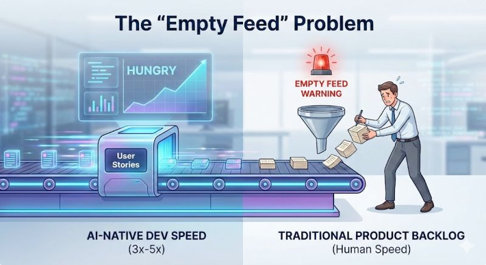

We are giving developers Ferrari engines (AI Agents), but is the rest of your SDLC still driving a go-kart? 🏎️💨

<!--more-->

This week, I am diving into the hidden bottlenecks of the AI-Native Engineering approach, starting with the impact on the rest of your organization.
First up: The "Empty Feed" Problem.
If your developers are using Copilot or Cursor, they are likely writing code 3-5x faster. They are going to burn through your backlog at a frightening pace.
The disconnect? The traditional process of gathering requirements, writing detailed acceptance criteria, and refining stories still takes days.
If a Product Owner cannot "feed the beast" fast enough, you face two immediate risks:
Idle Time: Developers sit waiting for work (expensive).
Shadow Scoping: Developers start "improvising" features without specs (dangerous).
As a Product Owner, are you ready to produce 3x the user stories you do now just to feed an AI-augmented development team?
If your backlog runs dry next Tuesday, will your developers wait for you... or will they start building without a map? 🗺️
Drop your thoughts below. Tomorrow, we’ll look at what happens to Quality Assurance when the code avalanche hits. 👇

