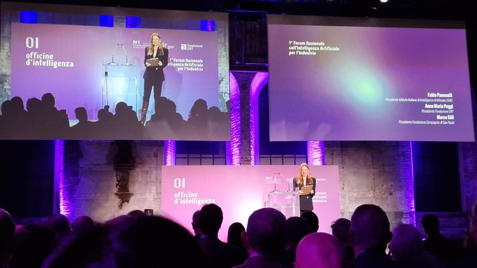
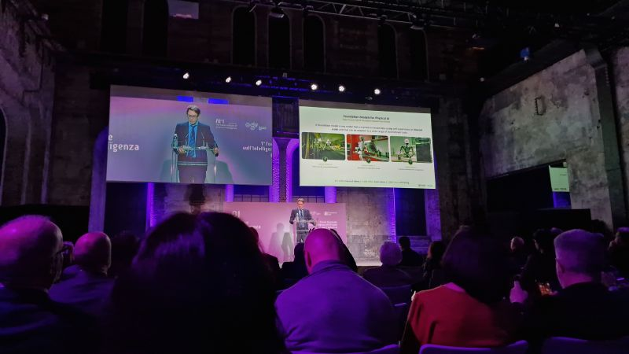
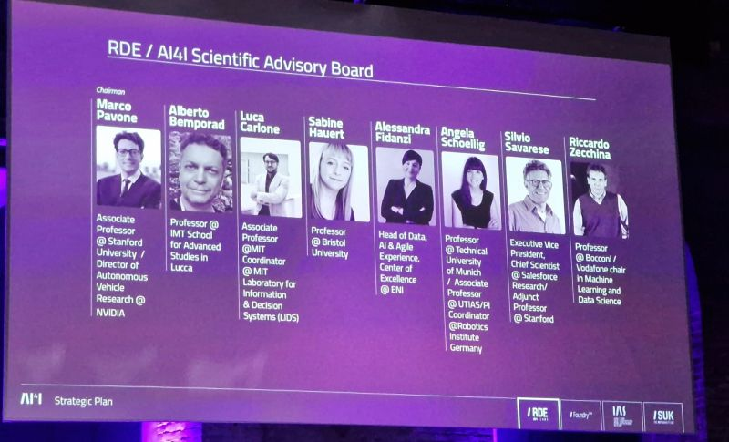
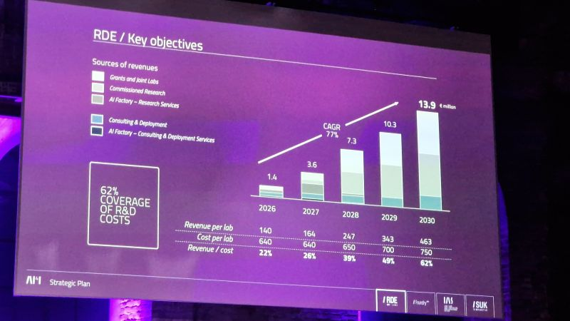

What I took away from the 1st Forum on Artificial Intelligence for Industry.

<!--more-->

Italy is doing much more than I imagined to support the industry during this transition.
Some key insights:

**AI beyond software**: We are familiar with Agentic AI, but it already feels like a concept of the past; now the focus is on "Physical AI."

**Hardware + Software**: Physical AI means making hardware and software work together. As Europe, we are behind on both. Alberto Luigi Sangiovanni-Vincentelli urged us to be innovative: we need to stop chasing and start anticipating the next trend.

**Education is essential**: Hardware and software are important, but we need talent capable of creating and using them. During a quick chat over lunch, Marco Pavone noted how global universities update their curriculums extremely fast to meet market needs; Italian universities need to do the same.
  
**Beyond education**: Talent attracts talent, while a lack of talent drives it away. These were the words of Fabio Pammolli, who explained why creating hubs of excellence is essential for innovation.

Overall, it was an inspiring event bringing together top experts from both academia and the private sector.

The discussions spanning from Agentic to Physical AI highlighted a clear path for Italy and Europe to regain competitiveness.

It will take time, investment, and talent, bridging the gap between research and industry, but the potential is there.

We can make it happen.

