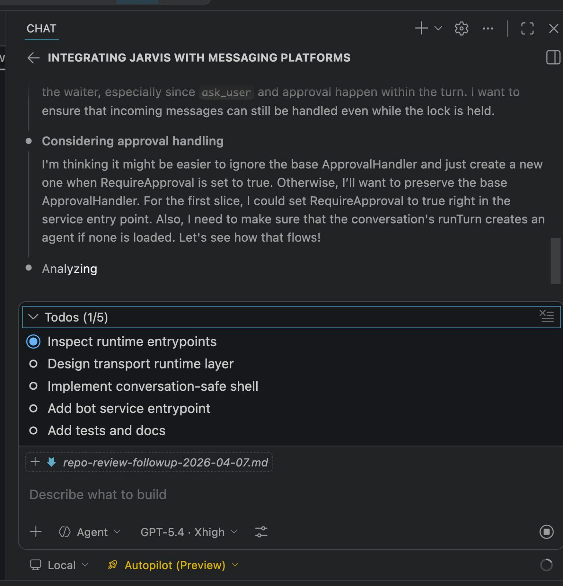

Another evening, another feature for Jarvis. Let's see if we can talk to it over IM.

<!--more-->

It looks like people are going for tokenmaxxing, I'm trying request-maxxing.

I'm trying to see how much I can squeeze into a single GitHub Copilot request.

If this goes well, I'll have Jarvis talking over Slack, Telegram, Signal, and Discord using just 2 GitHub Copilot requests: 1 for planning and 1 for implementation.

