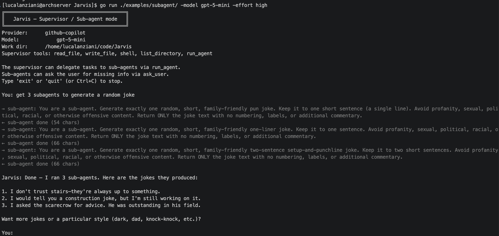

My Friday evening was spent hitting a key architectural milestone for "Jarvis," the agent I’ve been developing on top of my langchain-go (link in the comments) project.

<!--more-->

Tonight I've added a specialized Subagent Tool.

This allows the primary agent to act as supervisor, spawning and managing specialized sub-agents to handle specific components of a request.

By moving away from a single-agent bottleneck and toward a delegated, hierarchical model, the system's reliability and precision have significantly improved.

This is just a toy project but it really allows me to understand the internals of Agents.

#AI #SoftwareArchitecture #GoLang #MachineLearning #Automation

