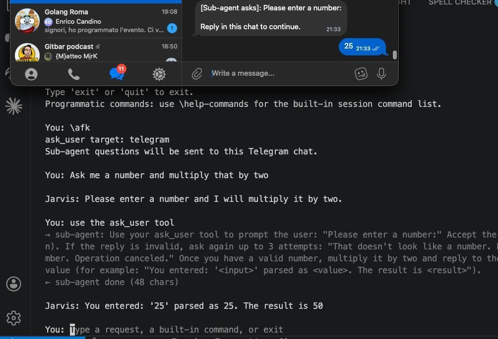

Project Jarvis: Why I Decided to Build My Own AI Assistant

<!--more-->

I’ve been working on a personal "Jarvis" for few weeks and while there are plenty of AI tools out there, I decided to build my own.
Here is why:

- Theory vs. Practice: I can read about AI all day long. But no matter how fast I pick up new concepts, nothing beats learning by doing, and while I'm already doing some of this at Nearform, I wanted a project where I could experiment freely without constraints.

- An AI Engineering Playground: I wanted a space to experiment. What's better than building an AI agent that operates as its own AI Harness using Spec-Driven Development, plan mode or even vibe coding at times.

- Building for an Audience of One: Jarvis is still in its early days, but it’s already proving its worth. Yesterday, I set it to solve a problem and stepped away, I came back and I found it was waiting for an input and it didn't progress much on the task... Because I own the code, I added the \afk command, Jarvis automatically routes its notifications to my Telegram when I step away.

- The Manager's Dilemma (A Bonus Reason): Let’s be honest, I just miss coding. Transitioning into management means my time in the IDE very limited. Jarvis is my creative hobby, keeping my engineering skills sharp while building something genuinely useful (to me).

What are you building for fun these days? Would love to hear about your side projects!

