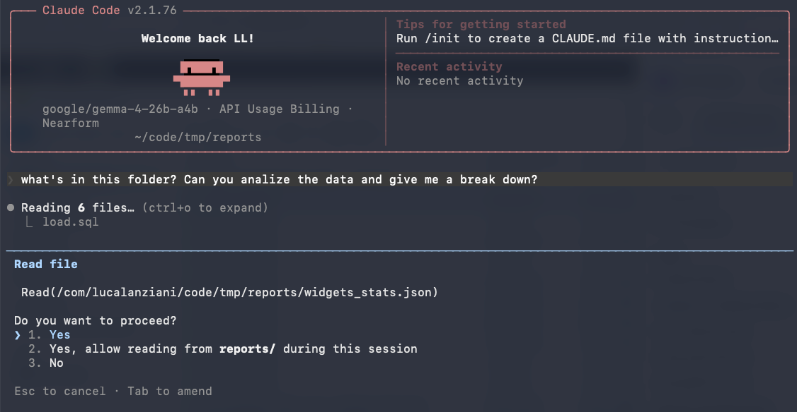

What better way to spend a couple of hours on Easter Monday than testing the new Gemma-4 with Claude Code via LM Studio?

<!--more-->

The performance isn't quite there yet, especially on my M2 Pro with 32GB of RAM, but it's still interesting to test the model's capabilities.

#Gemma4 #ClaudeCode #LMStudio #LocalLLM #GenerativeAI

