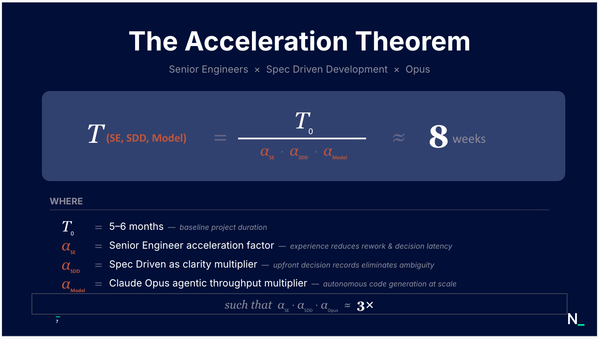
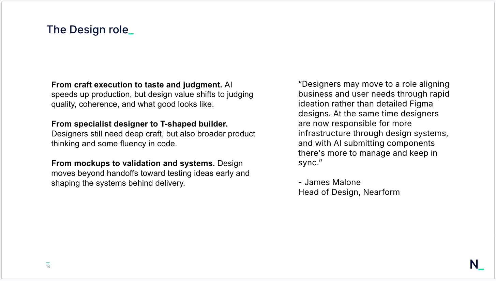

AI as an accelerant, shifting left on intent, and the rise of T-shaped roles.

<!--more-->

On May 6th, I presented the following slides at a Future Form event in London.

Today, I tuned into Google's presentation on building core skills for the AI era, and it was great to see so much overlap with my own talk.

It’s amazing to see how we at Nearform are arriving at the exact same conclusions as Google. It just goes to show that we are all navigating and learning this new landscape together.

My favorite takeaway was their concept of "shifting left on intent" to frame Spec-Driven Development. Because we can now generate code at incredible speeds, focusing heavily on our initial intent is more crucial than ever.

We have to be crystal clear so that AI agents understand exactly what we want to build.

There is a lot to unpack in Google's presentation.
You can find the link in the first comment!

