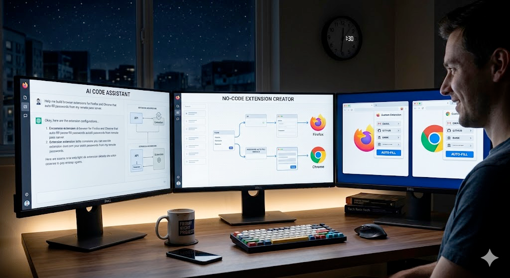

Another Friday night project! For years, I’ve used pass on a remote server, but I never had a simple way to use those passwords in the browser without the usual copy-paste dance.

<!--more-->

Building a browser extension always felt like a project I’d talk about but never start—too many pieces, too easy to get stuck, and too easy to abandon.

This time, I just sat down and built it in a few hours. I didn't even write the code, but I now have two working extensions: one for Firefox and one for Chrome.

If you’ve been telling yourself “I’ll do that someday” about a small tool that would make your life easier, maybe today is the day.

It might take way less time than you think.

