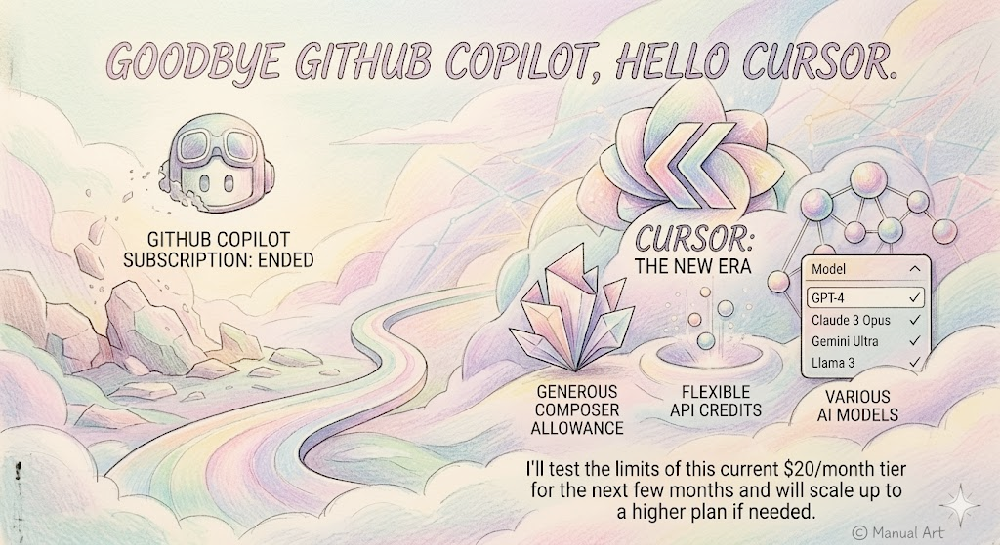

Goodbye GitHub Copilot, Hello Cursor.

<!--more-->

As I shared last month, I recently ended my GitHub Copilot subscription. After evaluating a few alternatives, I’ve transitioned to Cursor’s $20 monthly plan.

My main requirement was a platform that allowed me to experiment with various AI models while providing enough capacity for real development. Cursor delivers on this perfectly, offering a generous Composer allowance and flexible API credits.

I'll test the limits of this current tier for the next few months and will scale up to a higher plan if needed.

