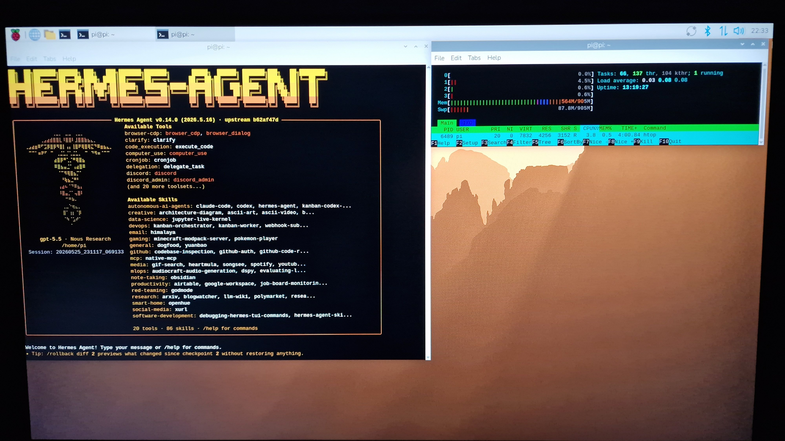
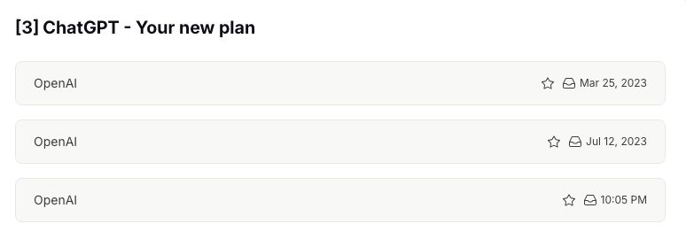

Hermes + GPT-5.5, will it work?

<!--more-->

Hermes is now running, and it's using GPT-5.5 on my brand-new OpenAI plan.

Did it really need such a model?

Maybe not, but I want to make sure that potential bad results cannot be attributed to a bad model, and GPT-5.5, as many say, is now one of the best out there.

Coincidentally, subscribing to OpenAI again has reminded me that I first subscribed more than three years ago (before that I was using the API), and how quickly time passes.

I often start my talks about AI with, "I was a skeptic but I became a believer last year," and people think that's because I wasn't testing AI before then.

I will now include the second picture in my future talks to show that YES, I was testing AI early, and YES, AI was producing some value back then, but not enough to convince me to fully buy into it.

I will evaluate Hermes the same way. I will only buy into it if it generates value for me, not if it is simply a fun toy.

