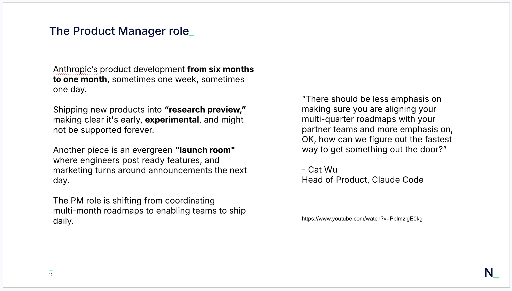
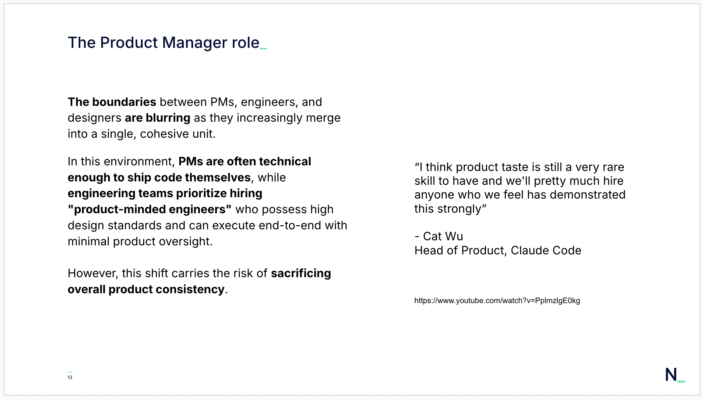
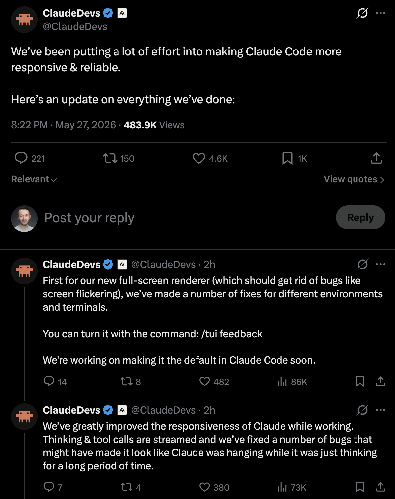

Shipping faster should not be your end goal!

<!--more-->

A few more slides from my talk at FutureForm, where I discussed what Cat Wu, Head of Product at Claude Code, shared in a recent podcast.

Anthropic is giving everyone more agency to act as a product owner and doing everything possible to help people ship faster. They want product-minded people who can potentially drive the whole process from ideation to delivery.

To accelerate this, they had to change their approach from shipping new products to shipping “research previews,” making it clear that these are early, experimental, and might not be supported forever.

Unfortunately, by doing this, they are shipping unstable products and, in Cat’s words, sacrificing overall product consistency. This is something they seem to know themselves, as you can see in the third image.

This might be a winning strategy for an AI lab like Anthropic, which is still fighting for a slice of the market.

Will it be a winning strategy for the rest of us?

