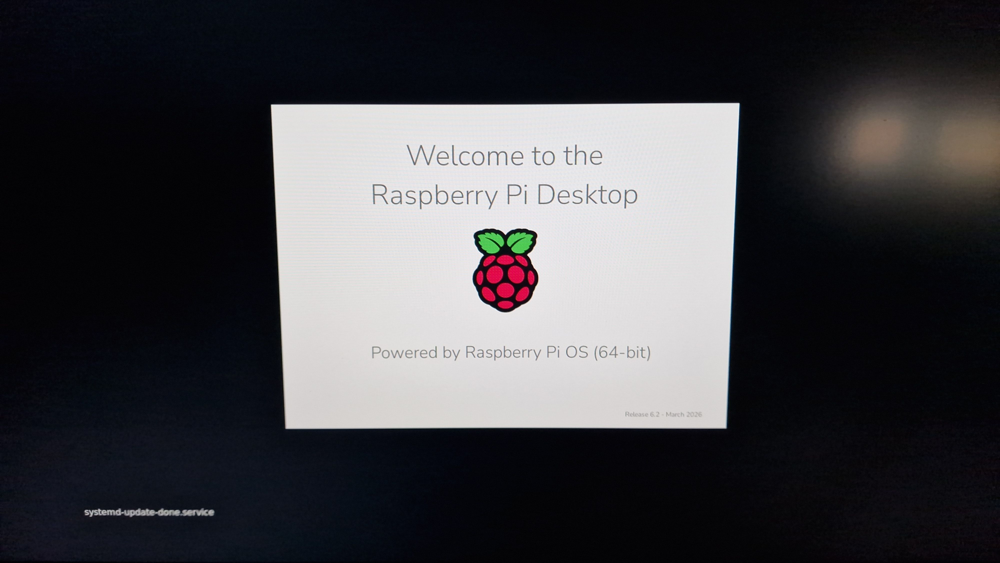

Time to test Hermes.

<!--more-->

I skipped OpenClaw. Too much hype.

I've been building my own agent (Jarvis) in the evenings. @Gabriele Menenio Magno and @Matteo Pietro Dazzi kept talking about Hermes this week, so I'm trying it on a Raspberry Pi.

Hermes is built for a machine that stays on. Not my laptop. The Pi is cheap, and if I wreck the install I reflash the card.

The Pi is on a private VLAN with no route to the rest of the house. No NAS, no cluster, no home server.

Week one: install, hermes setup, see what breaks.

I still don't have a model or subscription picked. If you've found one that works well for agents, I'm all ears.

